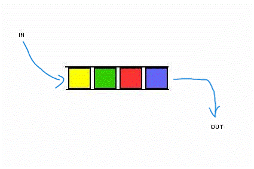
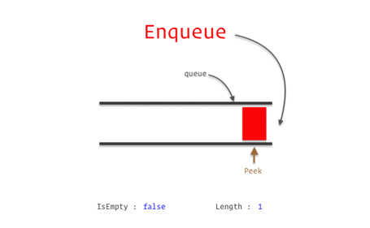

# The Queue
## Introduction
A queue is a data structure that follows the First-In-First-Out (FIFO) principle. 
In simpler terms, the first element added to the queue will be the first one to be removed. 
It's analogous to a queue of people waiting for a service.

## What is a Queue
A queue is a group of elements that can do two main actions: 
enqueue (adding an element to the end of the queue) 
and dequeue (removing an element from the front of the queue).




## How does it Work
When elements are added to a queue, they join the back of the line. 
Elements are removed from the front of the line. 
This ensures that the oldest items in the queue are handled first.



## Real life examples
There are many example of Queues in every day life, many of which involve waiting in lines. Such as:
* The Checkout line in a grocery store
* Waiting to get on a ride at an Amusement park.
* And so on...

Here is a snippet of how the code could work for an Amusement park line:
```C#
 Queue<Person> rideLine = new Queue<Person>();
 //This adds a person to the line for the ride
 rideLine.Enqueue("John Smith");
 rideLine.Enqueue("John Doe");
 rideLine.Enqueue("Jane Smith");
 rideLine.Enqueue("Jane Doe");
 //Other code you may need to include depending on what you are trying to accomplish...
 
//This will remove one person at a time from the Queue in the order they were added
  foreach (person in rideline)
  {
     Console.Writeline(person);
     rideLine.Dequeue(person);
  }
/* The result you should get from the code would be:
    John Smith
    John Doe
    Jane Smith
    Jane Doe
*/
```


## Efficiency of common operations
* Enqueue operation: O(1)
* Dequeue operation: O(1)
* Peek operation (viewing the front element without removing it): O(1)
* O(1) or O of 1 means that it it will take the same amount of time to complete the task no matter what size it is.

## Example Problem
The code snippet below is an example on how you can use queues to create a Song List queue
for a music app like Spotify or Apple Music.

```C#
class Program
{
    static void Main(string[] args)
    {
        // Create a queue to represent the music app queue
        Queue<string> musicQueue = new Queue<string>();

        // Enqueue some songs to the queue
        musicQueue.Enqueue("Song 1 - Artist 1");
        musicQueue.Enqueue("Song 2 - Artist 2");
        musicQueue.Enqueue("Song 3 - Artist 3");

        // Display the current playlist
        Console.WriteLine("Current Playlist:");

        foreach (var song in musicQueue)
        {
            Console.WriteLine(song);
        }

        // Dequeue a song (simulate playing the next song)
        Console.WriteLine("\nNow Playing: " + musicQueue.Dequeue());

        // Display the updated playlist
        Console.WriteLine("\nUpdated Playlist:");

        foreach (var song in musicQueue)
        {
            Console.WriteLine(song);
        }
    }
}
```

### The expected result would be:

```
Song 1 - Artist 1
Song 2 - Artist 2
Song 3 - Artist 3
```

## Problem to Solve
For this problem you will be using your understanding of queues and the code snippet above
to help you create a bug submission feature for our music app. 

Click the "Problem" link below to get started.

[Problem](ds1-problem/Program.cs)

Please only look at the solution after you have given your best attempt to create
a solution to the problem.

[Solution](ds1-solution/Program.cs)


[Back To Welcome](0-welcome.md)