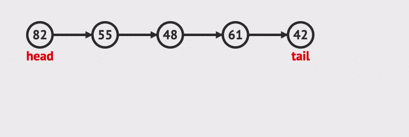
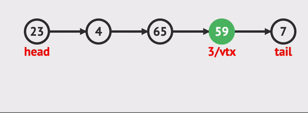

# Linked Lists 
## Introduction
A linked list is a linear data structure that consists of a collection of nodes, 
each containing data and a reference (link) to the next node in the sequence. 
In other words, each node points to the next node in the list, 
forming a chain-like structure.

## What is a Linked list
A linked list is a dynamic array that can grow or shrink as needed, 
unlike an array which has a fixed size. 
It allows for efficient insertion and deletion of elements at any position in the list. 
It does not follow any particular order, such as FIFO or LIFO (Last-In-First-Out).


## How does it work
Each node in a linked list contains two parts: data and a link (next pointer). 
The first node, called the head or the sentinel, has no link to any other node. 
Nodes are added to the end of the list by updating the next pointer of the 
last node to point to the new node.

* This is an example of inserting a node into a linked list:



* This is an example of removing or deleting a node from a linked list:



## Real Life Examples
There are many real-life examples of linked lists, such as:

* Phonebooks: Each contact stores a name and phone number, 
and the next contact’s data is stored in the next memory location.
* Playlists: Each song has its title, artist, and a pointer to the next song in the playlist.

The code snippet below shows how you can add a node to the "PhoneBook" in this program:

 ```C#
public class PhoneBook
{
    private ContactNode _head;

    public void AddContact(string name, string phoneNumber)
    {
        if (_head == null)
            _head = new ContactNode(name, phoneNumber);
        else
        {
            var current = _head;
            while (current.Next != null)
                current = current.Next;
            current.Next = new ContactNode(name, phoneNumber);
        }
    }
    
    public static void Main(string[] args)
    {
        var phoneBook = new PhoneBook();
        phoneBook.AddContact("John Doe", "123-456-7890");
        phoneBook.AddContact("Jane Smith", "987-654-3210");
        phoneBook.AddContact("Alice Johnson", "555-555-5555");
        phoneBook.PrintPhoneBook();
    }
}
 ```

## Efficiency of common operations
* Insertion at the beginning: O(1)
* Insertion at the end: O(1)
* Deletion at the beginning: O(1)
* Deletion at the end: O(n)
* Searching for an element: O(n)

## Example Problem
The code below demonstrates how you could use linked lists to create a playlist function in a music app:
```C#
using System;

public class MusicNode
{
    public string SongTitle { get; set; }
    public MusicNode Next { get; set; }

    public MusicNode(string songTitle)
    {
        SongTitle = songTitle;
        Next = null;
    }
}

public class MusicList
{
    private MusicNode _head;

    public void AddSongToPlaylist(string songTitle)
    {
        if (_head == null)
            _head = new MusicNode(songTitle);
        else
        {
            var current = _head;
            while (current.Next != null)
                current = current.Next;
            current.Next = new MusicNode(songTitle);
        }
    }

    public void PrintPlaylist()
    {
        if (_head == null)
            return;

        var current = _head;
        while (current != null)
        {
            Console.WriteLine($"{current.SongTitle}");
            current = current.Next;
        }
    }

    public static void Main(string[] args)
    {
        var musicList = new MusicList();
        musicList.AddSongToPlaylist("Track 1");
        musicList.AddSongToPlaylist("Track 2");
        musicList.AddSongToPlaylist("Track 3");
        musicList.PrintPlaylist();
    }
}
```
### The expected result would be:
```
Track 1
Track 2
Track 3
```

## Problem to Solve
For this Problem I want you to impliment a playlist function to our music app.


[Problem](ds2-problem/Program.cs)

Please only look at the solution after you have given your best attempt
to create a solution to the problem.

[Solution](ds2-solution/Program.cs)