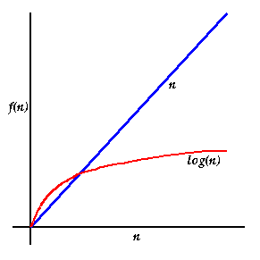

# Tree
## Introduction
A binary search tree (BST) is a self-balancing binary tree data structure that maintains the following order:

* The left subtree of a node contains only nodes with keys less than the node’s key.
* The right subtree of a node contains only nodes with keys greater than or equal to the node’s key.
* The left and right subtrees each must also be binary search trees.

## What is a Binary Search Tree
Think of a binary search tree like a family tree but for organizing numbers or other data. 
It's a way to put data in order so you can quickly find, add, or remove them.


For binary search trees, each box in the family tree above represents a piece of data
that we call "Nodes" in programming. They look like this:
```C#
public Node(int item)
    {
        data = item;
        left = right = null;
    }
```

## How does it work
* Sorting Rule: Every number in the tree has a position based on its value. 
If a number is smaller than another, it goes to the left. If it's bigger or equal, it goes to the right.
* Hierarchy: Each number has its own spot in the tree, and each spot can have two "children" (left and right).
* Quick Lookup: Because of how the tree is organized, 
you can quickly find any number just by following a simple path 
from the top (called the root) down to where the number should be.

## What can you do with a BST
1. Insertion: You can add new numbers to the tree. When adding, you compare the new number to the existing ones to find its proper place.
2. Searching: You can quickly check if a number is in the tree or not. You start from the top and follow a path based on whether the number you're looking for is smaller or larger.
3. Deletion: If you want to remove a number, you can do that too. It's a bit trickier because you need to make sure the tree still follows the sorting rules after removing the number.

## Why are BSTs useful?
Imagine you have a list of names sorted alphabetically. 
If you want to find a name, you can quickly jump to the 
right part of the list without searching every name. 
A BST works similarly but with numbers or other data. 
It's efficient for searching, adding, and removing items.


## Real life examples
Some real life examples of BSTs are:
* File Systems
* The Contacts on your phone
* Auto Correct
* Family Trees

## Efficiency of common operations
As explained earlier, when using this search method
you are able to substantially decrease the number of items you need to
iterate through to find the data you are looking for which results in
the following efficiencies.

* Search operation: O(log n)
* Insertion operation: O(log n)
* Deletion operation: O(log n)

Here is a visual aid to help show the difference
in efficiency:  



## Example Problem
The code snippet below demonstrates the creation and movement through a binary search tree using C#.
```C#
using System;

public class SongNode
{
    // Song metadata
    public string Title;
    public string Artist;
    public string Album;
    public double Duration; // Duration in seconds

    // Left and right children nodes
    public SongNode Left;
    public SongNode Right;

    // Constructor to initialize a new song node
    public SongNode(string title, string artist, string album, double duration)
    {
        Title = title;
        Artist = artist;
        Album = album;
        Duration = duration;
        Left = null;
        Right = null;
    }
}

public class SongBinarySearchTree
{
    private SongNode root;

    // Constructor to initialize an empty BST
    public SongBinarySearchTree()
    {
        root = null;
    }

    // Method to insert a new song into the BST
    public void Insert(string title, string artist, string album, double duration)
    {
        root = InsertRec(root, title, artist, album, duration);
    }

    // Recursive helper method to insert a new song
    private SongNode InsertRec(SongNode root, string title, string artist, string album, double duration)
    {
        // If the tree is empty, create a new node as the root
        if (root == null)
        {
            return new SongNode(title, artist, album, duration);
        }

        // Compare the title of the new song with the title of the current node
        int compareResult = string.Compare(title, root.Title);

        // If the new song title comes before the current node's title, go left
        if (compareResult < 0)
        {
            root.Left = InsertRec(root.Left, title, artist, album, duration);
        }
        // If the new song title comes after the current node's title, go right
        else if (compareResult > 0)
        {
            root.Right = InsertRec(root.Right, title, artist, album, duration);
        }
        // If the titles are the same (considering case sensitivity), do not insert (assuming each song is unique)
        // You may choose to handle duplicates differently based on your requirements

        // Return the modified root
        return root;
    }

    // Method to perform an in-order traversal of the BST (for demonstration purposes)
    public void InOrderTraversal()
    {
        InOrderTraversal(root);
    }

    // Recursive helper method to perform in-order traversal
    private void InOrderTraversal(SongNode root)
    {
        if (root != null)
        {
            InOrderTraversal(root.Left);
            Console.WriteLine($"Title: {root.Title}, Artist: {root.Artist}, Album: {root.Album}, Duration: {root.Duration} seconds");
            InOrderTraversal(root.Right);
        }
    }
}

class Program
{
    static void Main(string[] args)
    {
        // Create a new instance of the SongBinarySearchTree
        SongBinarySearchTree songBST = new SongBinarySearchTree();

        // Insert some sample songs
        songBST.Insert("Bohemian Rhapsody", "Queen","A Night at the Opera", 360);
        songBST.Insert("ABC", "The Jackson 5", "Second studio album", 175);
        songBST.Insert("Never Gonna Give You Up", "Rick Astley","Never Gonna Give You Up", 231 );
        songBST.Insert("Storm", "Jorge Riviera","Storm Saga", 154);
        songBST.Insert("Yesterday", "Imagine Dragons","Evolve", 206);

        // Perform an in-order traversal to display the songs in sorted order
        Console.WriteLine("Songs stored in the BST (in alphabetical order by title):");
        songBST.InOrderTraversal();
    }
}

```

### The expected result would be:
```
Songs stored in the BST (in alphabetical order by title):
Title: ABC, Artist: The Jackson 5, Album: Second studio album, Duration: 175 seconds
Title: Bohemian Rhapsody, Artist: Queen, Album: A Night at the Opera, Duration: 360 seconds
Title: Never Gonna Give You Up, Artist: Rick Astley, Album: Never Gonna Give You Up, Duration: 231 seconds
Title: Storm, Artist: Jorge Riviera, Album: Storm Saga, Duration: 154 seconds
Title: Yesterday, Artist: Imagine Dragons, Album: Evolve, Duration: 206 seconds
```

## Problem to Solve
For this problem, you will be using your understanding of binary search trees
and the code snippet above to help you implement a search feature into a music app.

Click the “Problem” link below to get started.

[Problem](ds3-problem/Program.cs)

Please only look at the solution after you have given your best attempt to create
a solution to the problem.

[Solution](ds3-solution/Program.cs)